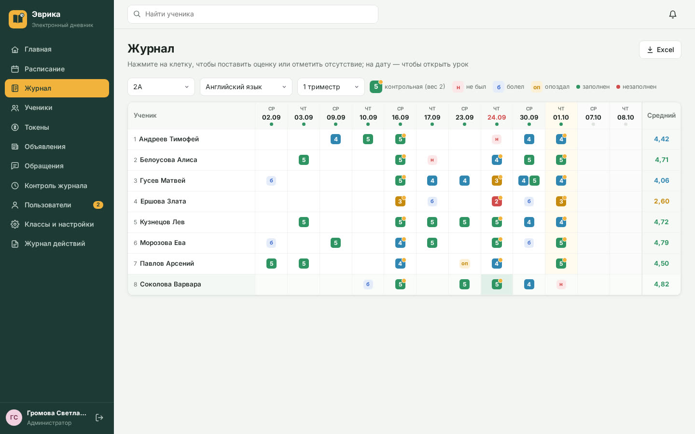
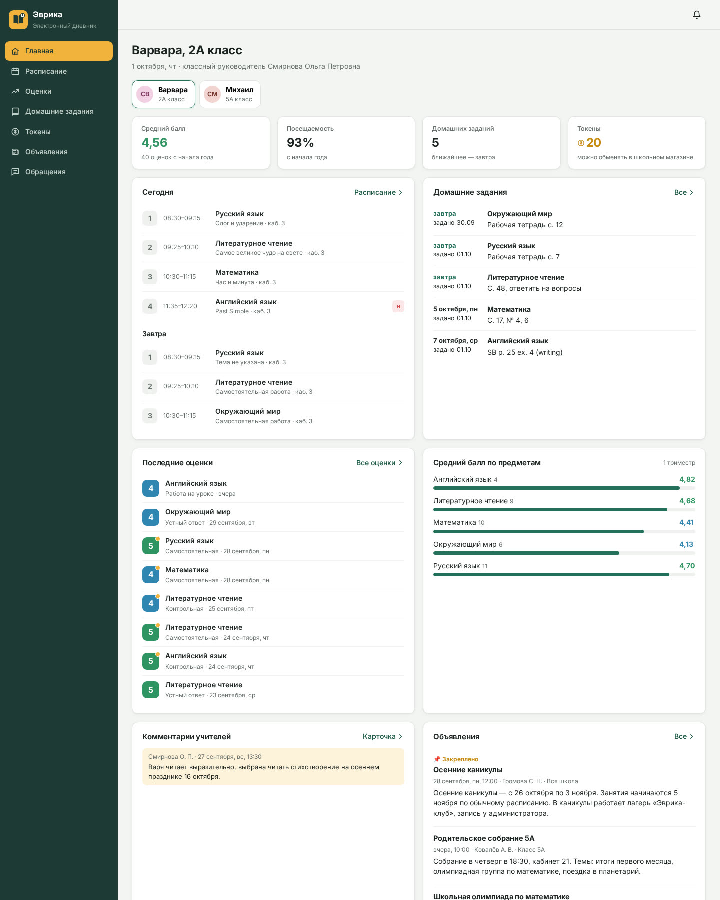
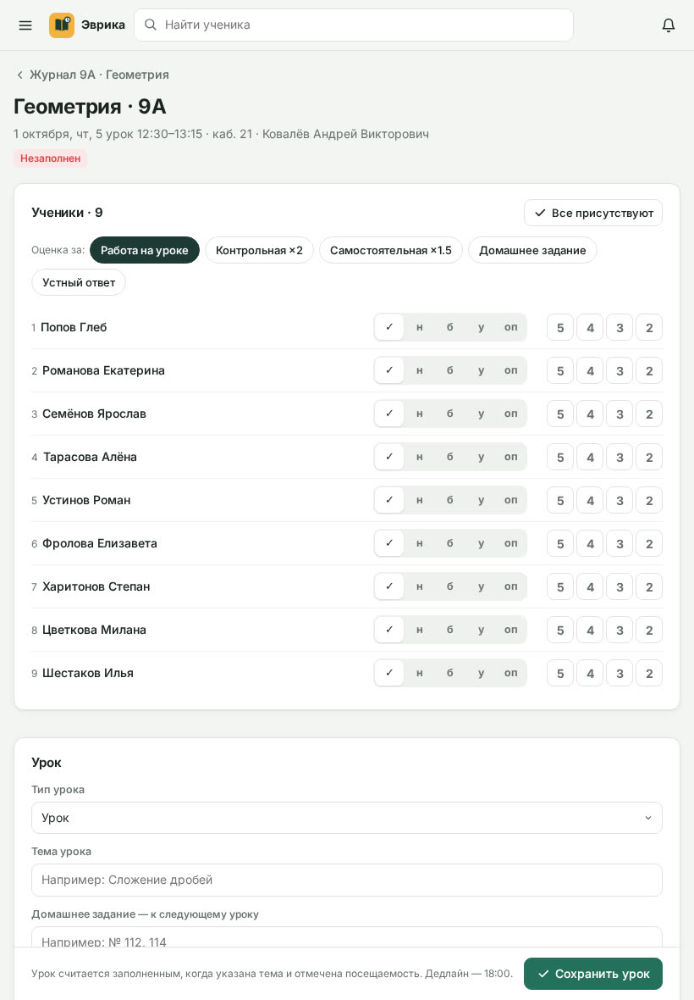

# Эврика · Дневник — электронный дневник частной школы

Закрытый веб-сервис частной школы: расписание, электронный журнал, контроль заполнения журнала до 18:00,
кабинет родителя, внутренние токены, объявления и обращения. Адаптивный: компьютер, планшет (журнал удобно заполнять
на планшете), телефон. MVP по реальному заказу с FL.ru («Разработка веб-сервиса „Электронный дневник частной школы“»).

**Демо:** запустите локально (`npm start`) — демо-школа создаётся автоматически. Пароль у всех демо-пользователей: `shkola`.

| Логин | Роль | Что видит |
|---|---|---|
| `admin` | Администратор (завуч) | всё: расписание, журналы всех классов, контроль заполнения и отчёт для оплаты, пользователи и модерация регистраций, настройки, журнал действий |
| `teacher` | Учитель математики, кл. руководитель 5А | свои уроки и журналы, таймер до 18:00, ученики своих классов, токены, объявления для своих классов, обращения родителей своего класса |
| `parent` | Родитель двоих детей (2А и 5А) | только своих детей: расписание на 5 недель, оценки и динамика, ДЗ, токены, комментарии учителей, объявления, обращения |



## Что умеет

- **Роли и права.** Администратор, учитель, родитель; права проверяются на сервере: учитель не может поставить оценку
  на чужом уроке и открыть карточку ученика не из своих классов, родитель видит только своих детей (даже по прямой ссылке)
  и не видит внутренние заметки учителей.
- **Регистрация родителей с модерацией.** Родитель оставляет заявку на странице входа, администратор привязывает его
  к ребёнку и подтверждает доступ (или отклоняет с причиной).
- **Классы, ученики, учителя, предметы.** Справочники, классные руководители, ставка учителя за урок.
- **Расписание.** Неделя по классу или по учителю, урок: класс, предмет, учитель, кабинет, дата и звонок.
  Сервер не даёт накладок (класс, учитель или кабинет уже заняты). Перенос, замена учителя, отмена урока —
  родители и учителя получают уведомление. Копирование недели на N недель вперёд (заполненные уроки не трогаются).
- **Электронный журнал.** Сетка «ученики × уроки» с оценками и посещаемостью, средний балл; клик по клетке —
  оценка или отметка «н / б / уваж. / опоздал». Страница урока для планшета: посещаемость в один тап, оценки 2–5 кнопками,
  несколько оценок за урок (до 3), вид оценки (работа на уроке, устный ответ, ДЗ, самостоятельная ×1,5, контрольная ×2),
  тип и тема урока, домашнее задание с файлами, учебные материалы. Средние баллы взвешенные, итог триместра считается сам.
  Выгрузка журнала в Excel.
- **Контроль заполнения до 18:00.** Урок заполнен, когда есть тема и отмечена посещаемость. У учителя на главной —
  таймер до дедлайна. В 16:00 — напоминание, в 18:00 — статус «Незаполнен» и сводка администратору.
  Отчёт для расчёта оплаты: проведено / вовремя / с опозданием / не заполнено × ставка, штраф за опоздание
  настраивается (по умолчанию −50 %), незаполненный урок не оплачивается; выгрузка в Excel для бухгалтерии.
- **Карточка ученика.** Оценки по предметам за триместр, итоги триместров, график динамики, посещаемость и пропуски,
  токены, внутренние заметки и комментарии для родителей, файлы, контакты родителей.
- **Кабинет родителя.** Переключение между детьми; сегодня и завтра, расписание на 5 недель, последние оценки, средний балл
  по предметам и динамика, домашние задания со сроками и файлами, токены, комментарии учителей, объявления, обращения.
- **Токены школы.** Начисление и списание с основанием (учитель — до +10 / −5 за раз, баланс не уходит в минус),
  история, лидеры, уведомление родителю.
- **Уведомления** о новых оценках, пропусках, ДЗ, изменениях расписания, токенах, комментариях, ответах на обращения
  и модерации регистрации. **Объявления** для всей школы, родителей, учителей или класса. **Обращения** родителей
  администрации и классному руководителю. **Журнал действий** и ежедневные резервные копии.



## Запуск

Нужен Node.js 18+. Внешних зависимостей нет.

```bash
npm start            # http://localhost:3000, при первом запуске создаются демо-данные школы
npm test             # сценарии: урок → оценки → дедлайн → оплата, права ролей, регистрация, токены, расписание, напоминания
```

Переменные окружения: `PORT` (по умолчанию 3000), `DATA_DIR` (база, файлы и копии; на Railway — том `/data`),
`TZ_OFFSET_HOURS` (часовой пояс школы, по умолчанию 5 — Екатеринбург).

## Устройство

- `server.js` — HTTP-сервер и API (`/api/...`), права, расчёты средних и статусов журнала, напоминания, копии.
- `seed.js` — демо-школа «Эврика»: 4 класса, 36 учеников, 7 учителей, расписание с 1 сентября и на 5 недель вперёд.
- `xlsx.js` — выгрузка в Excel без библиотек.
- `public/` — интерфейс одной страницей без фреймворков: `core.js` (каркас), `home.js`, `journal.js`, `schedule.js`,
  `people.js`, `admin.js`.

## Следующий этап (по ТЗ заказчика)

Подтверждение e-mail при регистрации, внутренний мессенджер, онлайн-оплата через Т-Банк с чеками 54-ФЗ,
импорт учеников и расписания из XLSX/CSV, Docker и мониторинг, PostgreSQL вместо файла базы.


